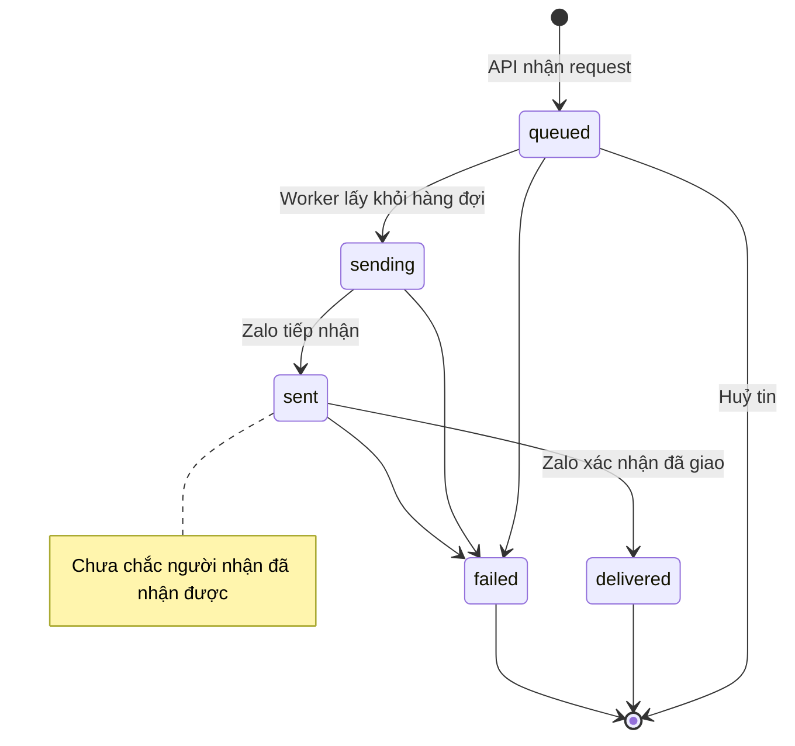
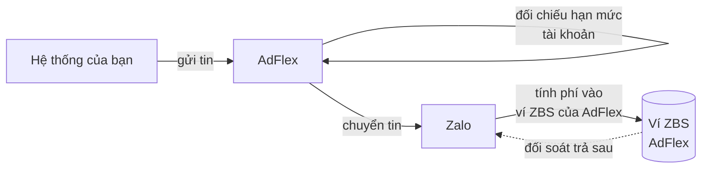

## Vòng đời tin



| Trạng thái | Ý nghĩa |
|---|---|
| `queued` | Đã tiếp nhận, chờ gửi. Tin đặt lịch ở trạng thái này tới giờ gửi. Huỷ được |
| `sending` | Đang gọi API Zalo |
| `sent` | Zalo đã tiếp nhận. Chưa xác nhận giao tới người nhận |
| `delivered` | Zalo xác nhận đã giao |
| `failed` | Thất bại. Xem `error_code` và `error_reason` |

Chuyển trạng thái `sent` → `delivered` dựa trên webhook của Zalo. AdFlex đối soát bổ
sung mỗi 5 phút cho các tin `sent` trong 24 giờ gần nhất.

## Mã lỗi HTTP

| Mã | Nguyên nhân | Xử lý |
|---|---|---|
| `400` | Body sai, thiếu trường, `tracking_id` không hợp lệ, vượt 500 người nhận, hoặc vượt hạn mức tài khoản (`/send`) | Sửa request, hoặc liên hệ AdFlex |
| `401` | Thiếu key, key sai hoặc đã thu hồi | Kiểm tra cấu hình |
| `402` | Vượt hạn mức tài khoản cho toàn lô (`/batch`, `/rsa`) | Liên hệ AdFlex tăng hạn mức |
| `403` | Thiếu scope hoặc workspace tạm dừng | Liên hệ AdFlex |
| `404` | Template không thuộc workspace, hoặc `msg_id` không tồn tại | Kiểm tra tham số |
| `409` | Tin cần huỷ không còn ở trạng thái `queued` | Không xử lý được |
| `5xx` | Lỗi hệ thống | Thử lại có kiểm soát |

## Thử lại

<Warning>
AdFlex không chống trùng. Gửi lại cùng `tracking_id` tạo tin mới và tính phí lần nữa.

Khi timeout mạng, request có thể đã được tiếp nhận. Tra cứu theo `tracking_id` trước
khi gửi lại.
</Warning>

```php
function sendZnsSafely(array $payload, int $maxAttempts = 3): array {
    $trackingId = $payload['tracking_id'];

    for ($attempt = 1; $attempt <= $maxAttempts; $attempt++) {
        try {
            return sendZns($payload);
        } catch (NetworkOrServerError $e) {
            $existing = findByTrackingId($trackingId);
            if ($existing !== null) return $existing;

            if ($attempt === $maxAttempts) throw $e;
            usleep((int)(pow(2, $attempt) * 500_000));
        }
    }
}

function findByTrackingId(string $trackingId): ?array {
    $r = getJson("/api/v1/messages?tracking_id=" . urlencode($trackingId));
    return $r['messages'][0] ?? null;
}
```

## Chi phí và hạn mức



Tin ZNS gửi qua ứng dụng Zalo của AdFlex và tính vào ví ZBS của AdFlex. Ví đó đối
soát trả sau với Zalo, nên **bạn không phải nạp tiền vào đâu cả**.

Thứ duy nhất liên quan tới bạn là **hạn mức tài khoản** — mức chi AdFlex cấp cho
workspace. Vượt hạn mức thì API trả `400` hoặc `402` kèm thông báo liên hệ AdFlex.

<Note>
Mã `-137` và `-115` **không phải do bạn hết tiền**. Đó là dấu hiệu Official Account
chưa được nối đúng vào tài khoản ZBS của AdFlex — một bước trong quá trình kết nối
OA. Liên hệ AdFlex.
</Note>

## Mã lỗi Zalo

Trả về trong trường `error_code` của tin. Trường `error_reason` chứa diễn giải tiếng
Việt, dùng được trực tiếp để hiển thị.

### Lỗi do dữ liệu của bạn

Sửa nguồn dữ liệu rồi gửi lại. Gửi lại nguyên trạng sẽ hỏng y như cũ.

| Mã | Ý nghĩa | Cách xử lý |
|---|---|---|
| `-108` | Số điện thoại không hợp lệ | Chuẩn hoá và kiểm tra định dạng trước khi gửi |
| `-118` | Tài khoản Zalo không tồn tại hoặc vô hiệu | Số nhận chưa có tài khoản Zalo. Không gửi lại được |
| `-1122` | Thiếu tham số bắt buộc | Bổ sung tham số còn thiếu vào `template_data` |
| `-1121` | Tham số vượt độ dài tối đa | Cắt cho vừa `max_length` của template |
| `-1124` | Sai định dạng tham số | Đối chiếu kiểu dữ liệu trong `GET /api/v1/templates` |

### Lỗi cấu hình phía AdFlex

Liên hệ AdFlex. Bạn không tự xử lý được, và cũng không phải nạp thêm tiền.

| Mã | Ý nghĩa |
|---|---|
| `-137` | Trừ ví ZBS thất bại — OA chưa nối đúng tài khoản ZBS của AdFlex |
| `-115` | Hết số dư ví ZBS |
| `-117` | OA chưa có quyền dùng template này |
| `-127` | Ứng dụng đang ở chế độ thử nghiệm, chỉ gửi được tới quản trị viên OA |
| `-120` | OA chưa được cấp quyền cho tính năng này |

### Ngoài tầm kiểm soát

| Mã | Ý nghĩa |
|---|---|
| `-110` | Người nhận dùng phiên bản Zalo quá cũ |
| `-114` | Tài khoản người nhận không hoạt động |

AdFlex tự thử lại 4 lần với lỗi tạm thời trước khi đánh dấu `failed`. Tin ở trạng
thái `failed` đã hết khả năng xử lý tự động.

Danh sách đầy đủ mọi mã Zalo xem [Phụ lục — toàn bộ mã lỗi](/guides/error-codes).
