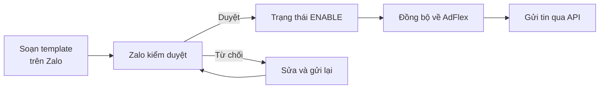

Template do **bạn đăng ký trực tiếp với Zalo** và Zalo kiểm duyệt. AdFlex không đăng
ký hộ và không sửa được nội dung template.

## Cấu trúc một template

Template gồm hai phần độc lập, kết hợp khi hiển thị tin:

| | Vai trò |
|---|---|
| **Components** | Khung hiển thị: tiêu đề, đoạn văn bản, bảng, nút hành động |
| **Parameters** | Dữ liệu động điền vào khung lúc gửi tin |

Mỗi parameter là một chỗ trống có tên, ví dụ `<customer_name>` hay `<order_code>`.
Khi bạn gọi API gửi tin, giá trị trong `template_data` được thay vào đúng chỗ trống
tương ứng.

<Note>
Tên parameter bạn đặt lúc đăng ký chính là khoá dùng trong `template_data`. Đặt tên
theo nghiệp vụ và giữ nguyên — đổi tên nghĩa là phải sửa cả code gửi tin.
</Note>

Mỗi loại component có ràng buộc riêng về độ dài, số lượng parameter và điều kiện bắt
buộc. Chi tiết xem tài liệu Zalo <a href="https://developers.zalo.me/docs/zalo-notification-service" target="_blank" rel="noopener"><Icon icon="arrow-up-right-from-square" size={13} /></a>.

## Các bước

<Steps>
  <Step title="Soạn template trên Zalo">
    Đăng nhập tài khoản Zalo Business của bạn và tạo mẫu tin cho Official Account.
    Khai báo đầy đủ components và parameters.
  </Step>
  <Step title="Chờ Zalo kiểm duyệt">
    Template ở trạng thái `PENDING_REVIEW`. Zalo duyệt hoặc từ chối kèm lý do.
  </Step>
  <Step title="Đồng bộ về AdFlex">
    Được duyệt xong, vào Console → Template <a href="https://business.adflex.vn/console/templates" target="_blank" rel="noopener"><Icon icon="arrow-up-right-from-square" size={13} /></a>
    và bấm **Đồng bộ**. Template xuất hiện trong hệ thống kèm `template_id` và danh
    sách parameters.
  </Step>
  <Step title="Lấy thông tin qua API">
    `GET /api/v1/templates?status=ENABLE` trả về `template_id` và `params` — đúng bộ
    dữ liệu cần cho việc gửi tin. Xem [Template và OA](/guides/templates).
  </Step>
</Steps>

## Chọn loại template

Zalo phân loại template theo mục đích sử dụng, và mỗi loại có hạn mức cùng quy định
riêng:

| Loại | Dùng cho |
|---|---|
| Giao dịch | Xác nhận đơn, OTP, biến động số dư — phát sinh từ hành động của người dùng |
| Chăm sóc khách hàng | Nhắc lịch, thông báo trạng thái dịch vụ |
| Khuyến mãi | Nội dung tiếp thị, có hạn mức riêng và chặt hơn |

Chọn sai loại là lý do bị từ chối phổ biến. Tin giao dịch đăng ký dưới dạng khuyến
mãi sẽ chịu hạn mức thấp hơn nhiều.

## Sau khi đăng ký

- Trạng thái template có thể đổi bất kỳ lúc nào do Zalo quyết định. AdFlex chỉ phản
  ánh bản đồng bộ gần nhất — xem [Template và OA](/guides/templates).
- Sửa nội dung template thực hiện phía Zalo, rồi đồng bộ lại.
- Chỉ template `ENABLE` mới gửi được. Xem [mã lỗi](/guides/errors) nếu bị từ chối.
