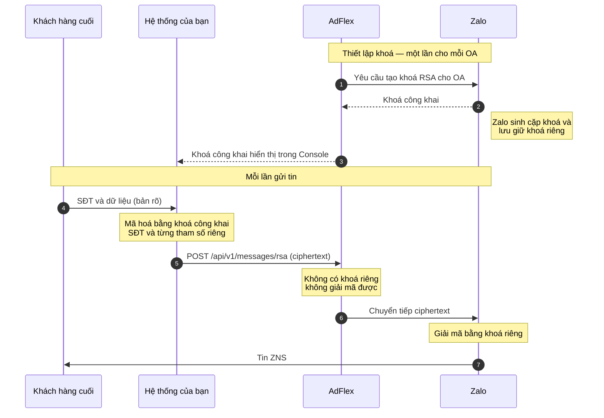

Hệ thống của bạn mã hoá số điện thoại và từng tham số bằng khoá công khai RSA của OA.
AdFlex chuyển tiếp ciphertext tới Zalo mà không giải mã. Khoá riêng do Zalo lưu giữ.

## Luồng hoạt động



| Thành phần | Dữ liệu truy cập được |
|---|---|
| Hệ thống của bạn | Bản rõ |
| AdFlex | Chỉ ciphertext. Trường số điện thoại lưu `NULL`, không nhận diện nhà mạng |
| Zalo | Bản rõ sau khi giải mã |

## Bước 1 — Lấy khoá công khai

Console → Official Account <a href="https://business.adflex.vn/console/oa" target="_blank" rel="noopener"><Icon icon="arrow-up-right-from-square" size={13} /></a> → **Thiết lập RSA key**.
AdFlex tạo khoá cho OA và hiển thị khoá công khai để bạn sao chép.

| Thuộc tính | Giá trị |
|---|---|
| Thuật toán | RSA 4096 bit |
| Định dạng | Base64 của SPKI DER |
| Độ dài chuỗi | 736 ký tự |
| Ciphertext mỗi trường | 512 byte → 684 ký tự base64 |

<Warning>
Tạo lại khoá làm vô hiệu mọi ciphertext mã hoá bằng khoá cũ. Cập nhật khoá trong hệ
thống của bạn ngay sau khi tạo lại.
</Warning>

## Bước 2 — Mã hoá

<Steps>
  <Step title="Chuẩn hoá số điện thoại">
    Về dạng `84xxxxxxxxx` trước khi mã hoá. AdFlex không giải mã được nên không thể
    chuẩn hoá thay bạn.
  </Step>
  <Step title="Mã hoá từng giá trị riêng">
    Số điện thoại là một lần mã hoá. Mỗi giá trị trong `template_data` là một lần mã
    hoá riêng. Tên tham số giữ nguyên, không mã hoá.
  </Step>
  <Step title="Encode base64 một dòng">
    Mỗi trường cho ra 684 ký tự.
  </Step>
</Steps>

### Thông số mã hoá

```
RSA/ECB/OAEP · hash OAEP = SHA-256 · MGF1 = SHA-1
```

MGF1 dùng SHA-1 trong khi OAEP dùng SHA-256. Khai báo tường minh cả hai tham số thay
vì dựa vào mặc định của thư viện.

### Hỗ trợ theo ngôn ngữ

| Ngôn ngữ | Thư viện chuẩn | Ghi chú |
|---|---|---|
| Java | Có | Khai báo `OAEPParameterSpec` |
| Python | Có | `cryptography` với `MGF1(SHA1)` |
| PHP | Không | Dùng `phpseclib3` |
| Node.js | Không | Dùng OpenSSL hoặc thư viện ngoài |
| Go | Không | `EncryptOAEP` dùng chung một hash |
| OpenSSL CLI | Có | Yêu cầu 1.1.1+ |

<Warning>
Thư viện chuẩn của Node.js và Go bỏ qua tham số MGF1 mà không báo lỗi, sinh ra
ciphertext dùng MGF1-SHA256. Request vẫn được AdFlex chấp nhận, tin thất bại khi
giải mã. Kiểm chứng bằng một tin thật trước khi triển khai.
</Warning>

<CodeGroup>
```java Java
byte[] der = Base64.getDecoder().decode(PUBLIC_KEY_B64);
PublicKey pub = KeyFactory.getInstance("RSA")
        .generatePublic(new X509EncodedKeySpec(der));

static String encrypt(PublicKey pub, String value) throws Exception {
    Cipher c = Cipher.getInstance("RSA/ECB/OAEPWithSHA-256AndMGF1Padding");
    c.init(Cipher.ENCRYPT_MODE, pub, new OAEPParameterSpec(
            "SHA-256", "MGF1", MGF1ParameterSpec.SHA1, PSource.PSpecified.DEFAULT));
    return Base64.getEncoder()
            .encodeToString(c.doFinal(value.getBytes(StandardCharsets.UTF_8)));
}
```

```python Python
import base64
from cryptography.hazmat.primitives import hashes, serialization
from cryptography.hazmat.primitives.asymmetric import padding

pub = serialization.load_der_public_key(base64.b64decode(PUBLIC_KEY_B64))

def encrypt(value: str) -> str:
    ct = pub.encrypt(
        value.encode("utf-8"),
        padding.OAEP(
            mgf=padding.MGF1(algorithm=hashes.SHA1()),
            algorithm=hashes.SHA256(),
            label=None,
        ),
    )
    return base64.b64encode(ct).decode("ascii")
```

```php PHP (phpseclib3)
use phpseclib3\Crypt\PublicKeyLoader;
use phpseclib3\Crypt\RSA;

$pub = PublicKeyLoader::load(base64_decode(PUBLIC_KEY_B64))
        ->withPadding(RSA::ENCRYPTION_OAEP)
        ->withHash('sha256')
        ->withMGFHash('sha1');

function encryptRsa($pub, string $value): string {
    return base64_encode($pub->encrypt($value));
}
```

```bash OpenSSL CLI
{ echo "-----BEGIN PUBLIC KEY-----"
  fold -w 64 <<< "$PUBLIC_KEY_B64"
  echo "-----END PUBLIC KEY-----"; } > oa.pem

printf '%s' "$value" \
  | openssl pkeyutl -encrypt -pubin -inkey oa.pem \
      -pkeyopt rsa_padding_mode:oaep \
      -pkeyopt rsa_oaep_md:sha256 \
      -pkeyopt rsa_mgf1_md:sha1 \
  | openssl base64 -A
```
</CodeGroup>

## Bước 3 — Gửi

`POST /api/v1/messages/rsa`, tối đa 500 người nhận.

```json
{
  "template_id": "123456",
  "recipients": [{
    "rsa_phone": "<684 ký tự base64>",
    "template_data": {
      "otp":  "<684 ký tự base64>",
      "time": "<684 ký tự base64>"
    },
    "tracking_id": "otp-login-8842"
  }]
}
```

```json Phản hồi
{
  "accepted": 1,
  "total": 1,
  "scheduled_at": null,
  "results": [
    { "msg_id": "m_a1b2c3d4e5f6g7h8", "tracking_id": "otp-login-8842", "status": "queued" }
  ]
}
```

Phần tử trong `results` không có trường `phone`. Đối soát bằng `tracking_id`.

## Giới hạn

- Tin RSA không có số điện thoại và nhà mạng trong báo cáo
- Không tra cứu được qua `GET /api/v1/messages?phone=…`
- Webhook DLR trả `"to": null`
- Mỗi trường mã hoá cho ra 684 ký tự bất kể độ dài gốc. Lô 500 người nhận với 5 tham
  số tương đương khoảng 2 MB. Khuyến nghị chia lô 100–200.

Chỉ hệ thống của bạn lưu giữ liên kết giữa `tracking_id` và khách hàng.

<Note>
Tham khảo thêm về cơ chế mã hoá RSA của ZNS:
[Zalo for Developers](https://developers.zalo.me/docs/zalo-notification-service/gui-tin-zns/gui-zns-voi-he-ma-hoa-rsa)
</Note>
