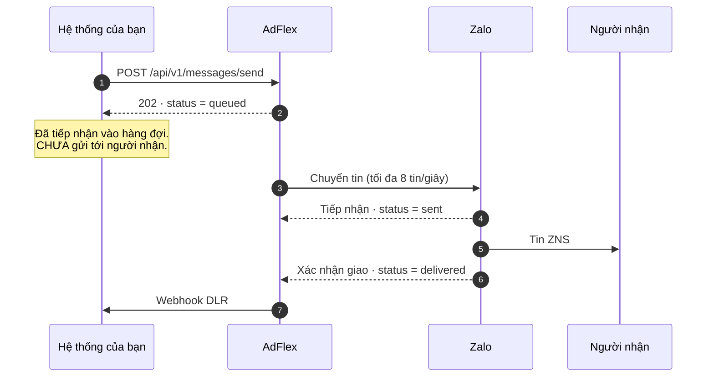

Mọi endpoint gửi trả `202 Accepted` khi tin vào hàng đợi. Mã này xác nhận tiếp nhận,
không xác nhận đã gửi tới người nhận.

## Vòng đời một request



Phản hồi `202` xảy ra ở bước 2, trước khi AdFlex gọi Zalo. Kết quả thật đến ở bước
6 và 7.

## Gửi một tin

`POST /api/v1/messages/send` — dùng cho OTP và tin giao dịch theo sự kiện.

| Trường | Bắt buộc | Mô tả |
|---|---|---|
| `template_id` | Có | Mã template phía Zalo |
| `phone` | Có | Số người nhận |
| `template_data` | Không | Tham số của template |
| `tracking_id` | Không | Mã đối soát, tối đa 48 ký tự |
| `send_at` | Không | ISO 8601, xa nhất 60 ngày |
| `mode` | Không | `plain` hoặc `hashphone` |

<CodeGroup>
```bash curl
curl -X POST https://business.adflex.vn/api/v1/messages/send \
  -H "Authorization: Bearer $ADFLEX_API_KEY" \
  -H "Content-Type: application/json" \
  -d '{
    "template_id": "123456",
    "phone": "84912345678",
    "template_data": { "otp": "246813", "time": "5 phut" },
    "tracking_id": "otp-login-8842"
  }'
```

```php PHP
function sendZns(array $payload): array {
    $ch = curl_init('https://business.adflex.vn/api/v1/messages/send');
    curl_setopt_array($ch, [
        CURLOPT_POST           => true,
        CURLOPT_RETURNTRANSFER => true,
        CURLOPT_TIMEOUT        => 15,
        CURLOPT_HTTPHEADER     => [
            'Authorization: Bearer ' . getenv('ADFLEX_API_KEY'),
            'Content-Type: application/json',
        ],
        CURLOPT_POSTFIELDS     => json_encode($payload, JSON_UNESCAPED_UNICODE),
    ]);
    $body = curl_exec($ch);
    $code = curl_getinfo($ch, CURLINFO_HTTP_CODE);
    $err  = curl_error($ch);
    curl_close($ch);

    if ($body === false) throw new RuntimeException("Lỗi mạng: $err");
    $json = json_decode($body, true);
    if ($code !== 202) {
        throw new RuntimeException($json['error']['message'] ?? "HTTP $code");
    }
    return $json;
}
```

```javascript Node.js
async function sendZns(payload) {
  const res = await fetch('https://business.adflex.vn/api/v1/messages/send', {
    method: 'POST',
    headers: {
      Authorization: `Bearer ${process.env.ADFLEX_API_KEY}`,
      'Content-Type': 'application/json',
    },
    body: JSON.stringify(payload),
    signal: AbortSignal.timeout(15_000),
  });
  const json = await res.json();
  if (res.status !== 202) {
    throw new Error(json?.error?.message ?? `HTTP ${res.status}`);
  }
  return json;
}
```

```java Java 11+
HttpClient http = HttpClient.newHttpClient();

String body = """
    {"template_id":"123456","phone":"84912345678",
     "template_data":{"otp":"246813","time":"5 phut"},
     "tracking_id":"otp-login-8842"}
    """;

HttpRequest req = HttpRequest.newBuilder()
    .uri(URI.create("https://business.adflex.vn/api/v1/messages/send"))
    .header("Authorization", "Bearer " + System.getenv("ADFLEX_API_KEY"))
    .header("Content-Type", "application/json")
    .timeout(Duration.ofSeconds(15))
    .POST(HttpRequest.BodyPublishers.ofString(body, StandardCharsets.UTF_8))
    .build();

HttpResponse<String> res = http.send(req, HttpResponse.BodyHandlers.ofString());
if (res.statusCode() != 202) {
    throw new IllegalStateException("Gửi thất bại: " + res.body());
}
```
</CodeGroup>

```json Phản hồi
{
  "msg_id": "m_a1b2c3d4e5f6g7h8",
  "tracking_id": "otp-login-8842",
  "status": "queued",
  "scheduled_at": null
}
```

Lưu `msg_id` để đối soát.

## Gửi lô

`POST /api/v1/messages/batch` — tối đa **500 người nhận** mỗi request. `send_at` và
`mode` áp dụng cho toàn lô.

```json Phản hồi
{
  "accepted": 1,
  "total": 2,
  "scheduled_at": null,
  "results": [
    { "phone": "84912345678", "msg_id": "m_abc", "tracking_id": "a1", "status": "queued" },
    { "phone": "84987654321", "status": "error", "error": "Template chưa được duyệt (status=REJECT)" }
  ]
}
```

<Warning>
`202` không đảm bảo mọi người nhận hợp lệ. Đối chiếu `accepted` với `total`; phần tử
`status: "error"` không được gửi và không có `msg_id`.
</Warning>

```php Xử lý kết quả
$res = postJson('/api/v1/messages/batch', $payload);

foreach ($res['results'] as $r) {
    if ($r['status'] === 'queued') {
        saveOutbound($r['tracking_id'], $r['msg_id']);
    } else {
        logFailure($r['tracking_id'] ?? $r['phone'], $r['error']);
    }
}
```

AdFlex kiểm tra hạn mức tài khoản cho toàn lô trước khi xếp hàng. Vượt hạn mức trả
`402` và không tin nào được gửi.

Khuyến nghị chia lô 100–200 người nhận để giảm chi phí thử lại khi lỗi mạng.

## Bảo mật số điện thoại

| Chế độ | Endpoint | AdFlex lưu SĐT | Zalo nhận |
|---|---|---|---|
| `plain` | `/send` · `/batch` | Có | Số thô |
| `hashphone` | `/send` · `/batch` | Có | SHA-256 của số |
| RSA | [`/messages/rsa`](/guides/rsa) | Không | Ciphertext |

Không truyền `mode` thì áp dụng mặc định của OA, cấu hình tại Console → Official Account <a href="https://business.adflex.vn/console/oa" target="_blank" rel="noopener"><Icon icon="arrow-up-right-from-square" size={13} /></a>.
