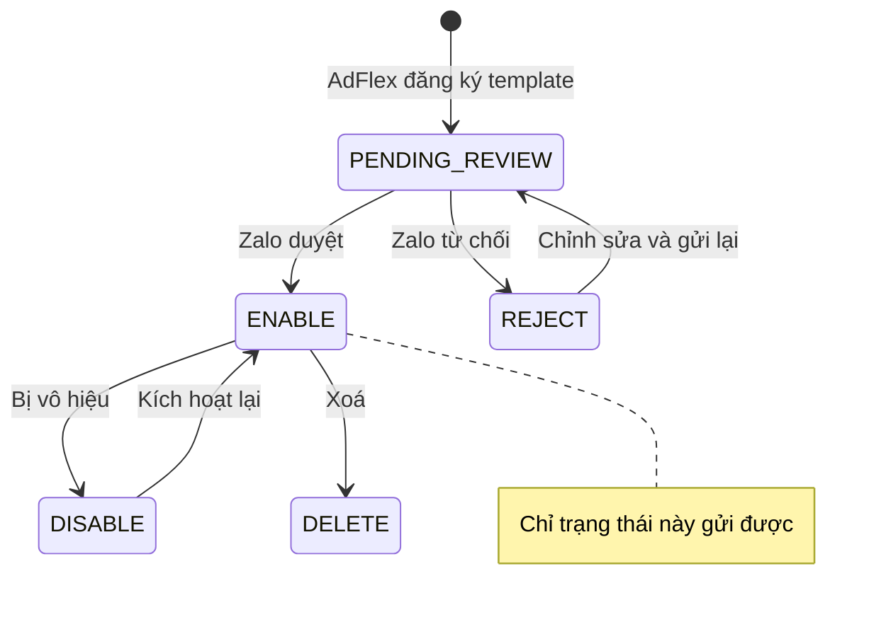

Template do AdFlex đăng ký với Zalo và Zalo duyệt. Hệ thống của bạn không tạo được
template qua API; endpoint dưới đây dùng để **đọc** thông tin cần cho việc gửi tin.

## Lấy danh sách template

`GET /api/v1/templates` · scope `templates:read`

Trả về mọi template thuộc các OA của workspace, kèm danh sách tham số Zalo yêu cầu.

| Query | Giá trị |
|---|---|
| `status` | `ENABLE` · `PENDING_REVIEW` · `REJECT` · `DISABLE` · `DELETE` |
| `oa_id` | Lọc theo một OA |

```bash
curl -H "Authorization: Bearer $ADFLEX_API_KEY" \
  "https://business.adflex.vn/api/v1/templates?status=ENABLE"
```

```json
{
  "templates": [
    {
      "template_id": "123456",
      "name": "Mã xác thực OTP",
      "status": "ENABLE",
      "template_type": 1,
      "oa_id": "1234567890123456789",
      "oa_name": "AdFlex",
      "preview_url": "https://account.zalo.cloud/znspreview/…",
      "params": [
        { "name": "otp",  "type": "STRING", "required": true, "max_length": 10, "min_length": 0 },
        { "name": "time", "type": "STRING", "required": true, "max_length": 30, "min_length": 0 }
      ]
    }
  ],
  "count": 1
}
```

### Trường trả về

| Trường | Mô tả |
|---|---|
| `template_id` | Giá trị truyền vào trường `template_id` khi gửi tin |
| `name` | Tên template |
| `status` | Trạng thái duyệt. Chỉ `ENABLE` gửi được |
| `template_type` | Loại template do Zalo phân loại |
| `oa_id` | OA sở hữu template |
| `oa_name` | Tên hiển thị của OA |
| `preview_url` | Đường dẫn xem trước nội dung template |
| `params` | Danh sách tham số, xem bên dưới |

<Note>
Endpoint không trả về giá tin. Chi phí xem tại [Console → Template](https://business.adflex.vn/console/templates).
</Note>

### Trạng thái template



| Giá trị | Ý nghĩa | Gửi được |
|---|---|---|
| `ENABLE` | Đã duyệt | Có |
| `PENDING_REVIEW` | Chờ Zalo duyệt | Không |
| `REJECT` | Zalo từ chối | Không |
| `DISABLE` | Bị vô hiệu | Không |
| `DELETE` | Đã xoá | Không |

Gửi tin bằng template không ở trạng thái `ENABLE` trả lỗi `400` với thông báo
`Template chưa được duyệt (status=…)`.

<Warning>
Trạng thái template do Zalo quyết định và có thể thay đổi bất kỳ lúc nào. Nếu hệ
thống của bạn cache `template_id`, hãy đồng bộ lại định kỳ thay vì cấu hình cố định
một lần.
</Warning>

### Tham số template

Mỗi phần tử trong `params` mô tả một tham số của `template_data`:

| Trường | Mô tả |
|---|---|
| `name` | Khoá dùng trong `template_data` |
| `type` | Kiểu dữ liệu Zalo khai báo, thường là `STRING` |
| `required` | Bắt buộc phải có giá trị |
| `max_length` | Độ dài tối đa của giá trị |
| `min_length` | Độ dài tối thiểu |

Giá trị truyền vào `template_data` luôn là chuỗi, kể cả với tham số mang ý nghĩa số
hoặc ngày tháng. Xem [Chuẩn hoá dữ liệu](/guides/prepare-data).

### Đồng bộ template về hệ thống của bạn

```php
function syncTemplates(): array {
    $r = getJson('/api/v1/templates?status=ENABLE');
    $map = [];
    foreach ($r['templates'] as $t) {
        $map[$t['template_id']] = [
            'name'   => $t['name'],
            'params' => $t['params'],
        ];
    }
    Cache::put('adflex:templates', $map, now()->addHours(6));
    return $map;
}
```

Lưu cả `params` để kiểm tra `template_data` phía bạn trước khi gọi API gửi.

## Lấy danh sách OA

`GET /api/v1/oas` · scope `templates:read`

```bash
curl -H "Authorization: Bearer $ADFLEX_API_KEY" \
  https://business.adflex.vn/api/v1/oas
```

```json
{
  "oas": [
    { "oa_id": "1234567890123456789", "name": "AdFlex" }
  ],
  "count": 1
}
```

Dùng `oa_id` để lọc template khi workspace có nhiều OA.
