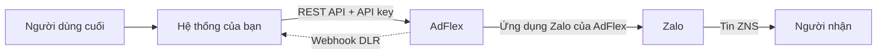

AdFlex ZNS API cho phép hệ thống của bạn gửi tin Zalo ZNS tới người dùng cuối. API
theo chuẩn REST, trao đổi dữ liệu JSON, xác thực bằng API key.

## Base URL

```
https://business.adflex.vn
```

## Kiến trúc



Bạn chỉ làm việc với AdFlex. Việc gọi Zalo, quản lý token của Official Account và
đối soát chi phí do AdFlex đảm nhiệm.

## Điều kiện sử dụng

| Yêu cầu | Nơi thiết lập |
|---|---|
| Official Account đã kết nối | [Console → Official Account](https://business.adflex.vn/console/oa) |
| Template ở trạng thái `ENABLE` | [Console → Template](https://business.adflex.vn/console/templates) |
| API key | [Console → Cài đặt → API Keys](https://business.adflex.vn/console/settings/api-keys) |

<Warning>
API vận hành ở chế độ production. Không có môi trường sandbox. Mỗi request thành
công tạo một tin thật tới số thật.

Để kiểm thử nội dung template không mất phí, dùng chức năng **Gửi thử** trong
[Console → Template](https://business.adflex.vn/console/templates). Chức năng này
chỉ gửi tới số quản trị viên của OA.
</Warning>

## Luồng tích hợp

<CardGroup cols={2}>
  <Card title="1. Lấy template" icon="list" href="/guides/templates">
    `GET /api/v1/templates` trả về `template_id` và danh sách tham số.
  </Card>
  <Card title="2. Chuẩn hoá dữ liệu" icon="filter" href="/guides/prepare-data">
    Số điện thoại, `template_data` và `tracking_id`.
  </Card>
  <Card title="3. Gửi" icon="paper-plane" href="/guides/send">
    `POST /api/v1/messages/send` hoặc `/batch`.
  </Card>
  <Card title="4. Nhận kết quả" icon="bell" href="/guides/webhooks">
    Webhook DLR và đối soát bằng API tra cứu.
  </Card>
</CardGroup>

## Ví dụ

```bash
curl -X POST https://business.adflex.vn/api/v1/messages/send \
  -H "Authorization: Bearer $ADFLEX_API_KEY" \
  -H "Content-Type: application/json" \
  -d '{
    "template_id": "123456",
    "phone": "84912345678",
    "template_data": { "otp": "246813", "time": "5 phut" },
    "tracking_id": "otp-login-8842"
  }'
```

```json
HTTP 202 Accepted
{
  "msg_id": "m_a1b2c3d4e5f6g7h8",
  "tracking_id": "otp-login-8842",
  "status": "queued",
  "scheduled_at": null
}
```

<Note>
`202` xác nhận tin đã vào hàng đợi, không xác nhận đã gửi tới người nhận. Kết quả
gửi tra qua [trạng thái tin](/guides/errors) hoặc [webhook DLR](/guides/webhooks).
</Note>
